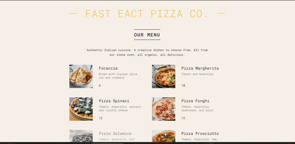

### README en Français

<a href="#readme-top-eng">README in English</a>

<!-- LOGO DU PROJET -->
 

<h3 align="center">Welcome to React Projet Pizza Menu 🧑‍🍳</h3>

  

    This React project features a dynamic pizza menu showcasing various Italian pizzas. Each item includes a photo, ingredients, and price, with availability status. The app includes a header, menu, and footer, displaying opening hours and offering online orders.
  

  
Please note that this project is a part of Udemy course : The Ultimate React Course 2024: React, Next.js, Redux & More
 

  

    <a href="https://github.com/Marikita1007/React-Pizza-Menu"><strong>Explore the documentation Pizza Menu »</strong></a>
     
  

